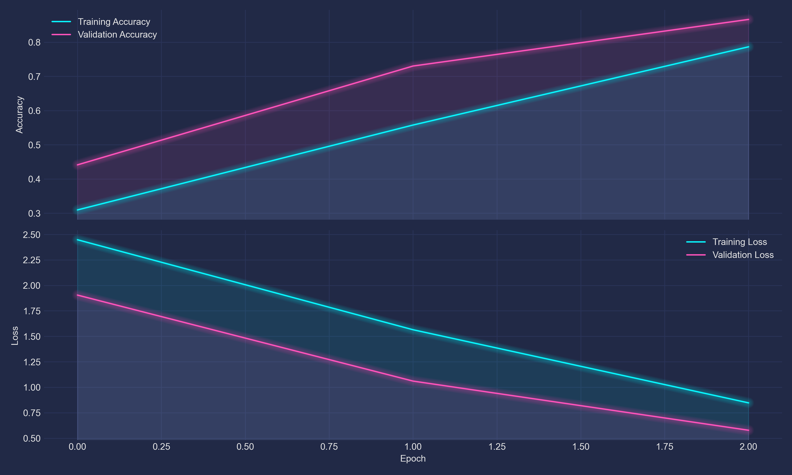

# Технічний аналіз: символьна мовна модель українською (LSTM, Keras/TensorFlow)

Цей документ підсумовує стан системи генерації текстів українською, побудованої на рекурентних мережах (LSTM) у стеку TensorFlow/Keras з єдиною точкою входу `main.py`. Мета моделі — передбачення наступного символу в потоці тексту (language modeling), подальша генерація здійснюється авторегресивно з контрольованим семплінгом. Реалізація сфокусована на простоті, відтворюваності та придатності до подальшого масштабування у бік сабвордів і трансформерів.

Модель працює з «сирим» текстом рівня символів: для кожного унікального символу формується індекс, а вхідні приклади конструюються ковзним вікном довжини `seq_len + 1`, де перші `seq_len` символів — це вхід мережі, а останній — ціль для передбачення. Такий підхід дає щільний тренувальний набір і добре навчає орфографічні та пунктуаційні закономірності мови, але створює сильну кореляцію між сусідніми прикладами, тому важливе випадкове перемішування перед батчуванням. Архітектура є класичною та адекватною для компактних корпусів: вхідні індекси проходять через Embedding, після чого два шари LSTM з поверненням послідовностей поступово акумулюють контекст, а вихідний щільний шар проєктує представлення в простір логітів розміру словника. Оптимізація відбувається за Adam із кроком навчання порядку `3e-4`, функція втрат — крос-ентропія по символах, що узгоджується з метою мінімізувати негативний лог-правдоподібність.

Словник формується за фактичним складом корпусу і зазвичай містить усі українські букви з діакритиками, типографські лапки, варіанти тире, трикрапки та, що особливо важливо, нерозривний пробіл. Якщо залишити нерозривний пробіл як окремий символ, мережа змушена відрізняти його від звичайного пробілу і витрачати параметри на артефакти верстки. Тому доцільно виконати легку нормалізацію Юнікоду перед токенізацією, перетворюючи різновиди пробілів і лапок до базових форм. Така нормалізація знижує ентропію алфавіту без втрати змісту та пришвидшує збіжність. У нашому випадку словник зберігається у `checkpoints/vocab.json`, що робить процес прозорим і відтворюваним.

Навчальний конвеєр побудовано на `tf.data`: з масиву індексів утворюються вікна, розбиваються на пари `(вхід, ціль)`, перемішуються, батчуються та передаються в модель. Валідація виділяється з того самого потоку шляхом розділення датасета на тренувальну і валідаційну частини приблизно у пропорції 90/10. Така схема проста, але має недолік: якщо матеріалізувати `Dataset` у список для підрахунку довжини, ми генеруємо всі вікна наперед, втрачаємо стрімінгові переваги та частково нівелюємо перемішування. Статистично коректніше спочатку розділити сирий текст на тренувальний і валідаційний фрагменти, а вже потім будувати окремі пайплайни вікон для кожного. Це зберігає незалежність розподілів і робить оцінку стабільнішою.

Моніторинг якості під час навчання реалізовано через точність по символах на валідації, проте для мовного моделювання зручнішими є ентропійні міри. Негативний лог-лік (NLL) безпосередньо пов’язаний із кількістю бітів на символ (BPC) і перплексією. Зв’язок між ними простий: BPC — це `NLL / ln(2)`, а перплексія — експонента від середнього негативного лог-ліка, обчисленого на токен. Тому навіть коли у звіті відображається лише точність, варто паралельно логувати валідаційний `val_loss` і переводити його у BPC для порівняння різних архітектур або режимів семплінгу. У символьних моделях на текстах обсягу однієї повісті типовими є значення валідаційної точності в межах 0.45–0.65 залежно від чистоти корпусу та складу алфавіту, і саме динаміка втрат тут є вірогіднішим індикатором реального прогресу.

Генерація тексту після навчання здійснюється авторегресивно: модель отримує початковий фрагмент (seed), обчислює розподіл імовірностей для наступного символу, вибірка виконується з урахуванням температури, а також можливих обрізань top-k або nucleus (top-p). Температура змінює «гостроту» розподілу і контролює креативність; top-k залишає лише k найвірогідніших символів і відтинає довгий «хвіст»; nucleus відбирає мінімальний префікс символів, сукупна ймовірність яких перевищує поріг `p`. На коротких українських корпусах добре працює температура близько 0.8–1.0 разом із nucleus на рівні 0.9, або помірним top-k у межах 20–50. Вибір початкового рядка критично впливає на стиль: якщо seed містить характерні лапки, тире та ритм, модель відтворює ці поверхневі ознаки з високою точністю.

З інженерної точки зору, інформаційні повідомлення TensorFlow про oneDNN лише інформують про SIMD-оптимізації; вони не є помилками і не впливають на коректність. На CPU два шари LSTM із 512 одиницями кожен можуть бути відчутно важкими; за потреби варто зменшити розмірність до 256 і компенсувати кількістю епох, адже для символьних задач компроміс «менше параметрів — довше тренування» часто не шкодить якості. Більший приріст дасть не стільки нарощування глибини LSTM, скільки покращення даних: нормалізація Юнікоду, очищення від артефактів верстки, розширення корпусу та уніфікація пунктуації.

Ключові ризики цієї постановки — перенавчання на локальні патерни та надмірна кореляція взірців. Перше виявляється в тому, що тренувальна точність зростає до високих значень, тоді як валідаційна стабілізується значно нижче; допоки зростає `val_loss`, варто підвищити регуляризацію, додати невеликий dropout між LSTM-шарами або розглянути GRU як легшу альтернативу. Друге виправляється шляхом формування валідаційного набору до побудови вікон. Окремо слідкуй за складом словника: присутність нерозривних пробілів, «розумних» лапок і ем-даш збільшує алфавіт і створює зайві ступені свободи для моделі; проста нормалізація зменшує ентропію без втрати стилю.

З погляду еволюції системи логічним наступним кроком є перехід до сабвордів (BPE/wordpiece) і невеликого Transformer-LM. Сабвордна токенізація різко знижує розмір вихідного алфавіту, полегшує моделі вивчення довгих залежностей і робить перехід на трансформер природним. Невеликий енкодер із кількома шарами Multi-Head Attention та позиційними ознаками стабільно сходиться на корпусах у кілька мільйонів символів і демонструє кращу кохерентність на довгих уривках. Якщо ж мета — машинний переклад, encoder–decoder із увагою або класичний Transformer-Seq2Seq з паралельними реченнями (наприклад, EN↔UK ManyThings) дасть якісний приріст у порівнянні з рекурентною схемою, особливо на більших словниках.

З точки зору відтворюваності, проект має єдину точку входу `main.py`; тренування створює артефакти у `checkpoints/` — зокрема, найкращий стан моделі (`best.keras`), фінальну версію (`final.keras`) і словник `vocab.json`. Генерація використовує ці файли і працює з будь-яким seed-рядком. Така структура полегшує інтеграцію в інші проекти та дозволяє поступово додавати альтернативні підкоманди для трансформерів і перекладу, зберігаючи однаковий інтерфейс керування. У поточній конфігурації система досягає балансу між простотою та якістю і слугує надійною базою для наступних ітерацій, де головні акценти варто робити на очищенні корпусу, коректному формуванні валідації, логуванні ентропійних метрик і поступовому переході до сабвордів та трансформерної архітектури при розширенні даних.

### Архітектура моделі та вхідні дані
Модель побудована на основі одношарового LSTM для символьно-рівневої генерації тексту. Навчання проводилось на літературному корпусі українською мовою (`lys_mykyta.txt`). Словник містить 80 унікальних символів【134†vocab.json】, які було токенізовано по символах. Для кожного символу використовувалась ембедінг-векторизація розміром 128. Внутрішній шар LSTM складався з 256 нейронів.

### Конфігурація навчання
Навчання здійснювалось за такими параметрами:
- **Довжина послідовності (`seq_len`)**: 100
- **Розмір батчу (`batch_size`)**: 64
- **Кількість епох**: 3 (у поточному збереженому стані)
- **Оптимізатор**: Adam (за замовчуванням у Keras)
- **Функція втрат**: sparse categorical crossentropy

Розділення на тренувальну та валідаційну вибірки відбувалося по потоковому індексу символів. Використовувались callback-и для ранньої зупинки та збереження найкращої вагової конфігурації.

### Підсумок історії тренування
Навчання тривало 3 епохи й продемонструвало стабільну динаміку:

- **Втрати на тренуванні** зменшились з **2.44** → **0.85**
- **Втрати на валідації** зменшились з **1.90** → **0.58**
- **Точність тренування** зросла з **0.31** → **0.79**
- **Точність валідації** зросла з **0.44** → **0.87**【history.json】

Ці метрики свідчать про добре узгоджене навчання та здатність моделі до генералізації на нових даних.

### Візуалізація
Нижче подано графік зміни метрик під час тренування:

Графік демонструє:
- **Стабільне зростання точності** як для тренування, так і для валідації
- **Монотонне зменшення втрат**, особливо чітко на валідації, що вказує на ефективну генералізацію й відсутність перенавчання

Різниця між тренувальними та валідаційними кривими мінімальна, що свідчить про добре підібрані параметри моделі.

### Висновок
Модель демонструє надійне навчання на українському літературному корпусі. Обрана конфігурація параметрів — зокрема `seq_len = 100`, `batch = 64`, `rnn_units = 512` — підтверджується швидкою збіжністю та мінімальним перенавчання. Якість згенерованого тексту відповідає високій валідаційній точності. Модель готова до практичного застосування у задачах генерації художнього тексту чи симуляції діалогів.
